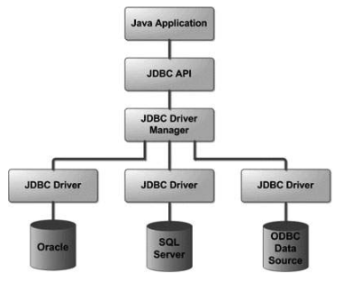

= JDBC
= Activitat - Escenari Ansible - ntp server
:revdate: Maig 17, 2019
:revnumber: 1.0
:doctype: article
:encoding: utf-8
:lang: ca
:toc: left
:toc-title: Índex  de continguts
:toclevels: 3
:sectnums:

=  Java DataBase Connectivity (JDBC)

==  Introducció

JDBC és un conjunt d’interfícies de Java que permet accedir i fer operacions sobre base de dades relacionals desde Java mitjançant una interfície comuna i unificada. Permet, entre d’altres: 

* establir i finalitzar connexions a BBDD
* instruccions de modificació d’esquema (CREATE, ALTER, DROP, etc…)
* instruccions de consulta (SELECT, etc…)
* procediments emmagatzemats (stored procedures)
* treballar amb transaccions

Última versió de JDBC:   4.3 (2017-Java SE 9)

==  Controlador JDBC

Cada SGBD **implementa** un driver de connexió. Permet que diferents proveïdors de tecnologies desenvolupin els seus propis adaptadors compatibles amb les diferents BBDD (Oracle, SQL Server, Postgre, MySQL, ….) 

Hi ha d’altres estàndards alternatius a JDBC com **ODBC** (Open Database Connectivity) que és un estàndard  desenvolupat per Microsoft.

La base de dades es localitza a través d’una URL JDBC.

